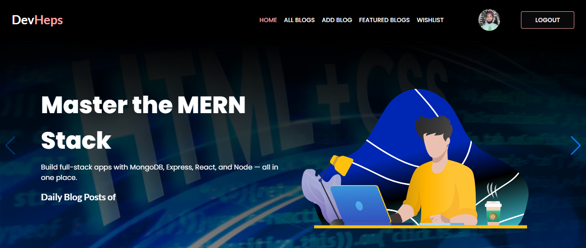

# DevHeps 📝

**DevHeps** is a modern and minimal blog post website built for developers and tech enthusiasts. It features a smooth and user-friendly experience with powerful developer tools integrated.

## 🔍 Description

A fully responsive and user-friendly blog platform built to share development insights, tutorials, and tech news in an elegant and accessible format. Clean UI with smooth interactions.

## 💡 Challenge

Creating **DevHeps** has been a powerful learning experience. I believed this project would have a big impact on my journey as a developer — and it did!  
Through this project, I explored:

- Modern form handling with **TanStack Form**
- Writing animation effects using **Typewriter**
- Routing experience via **React Router DOM**
- Smooth transitions and scroll animations
- Efficient component structure using **React**

It helped improve my production skills and introduced me to real-world performance optimization and responsive design thinking.

## 🚀 Features

- 📰 Blog post listing and details view
- 🔍 Clean and searchable UI
- 📱 100% Responsive across all devices
- 🎨 Smooth animations and transitions
- 💬 Interactive typewriter text
- 📤 Form with validation (TanStack Form)
- 🔁 SPA routing with React Router
- ⚛️ Built completely in React

## 🦞 Component Library

DaisyUI — A Tailwind CSS plugin that provides pre-built, customizable UI components for rapid development.

## 📦 Tech Stack

- React
- Tailwind CSS
- React Router DOM
- Typewriter Effect
- TanStack Form
- Framer Motion / Scroll Animations

React Loading Skeleton ⚙️:
I used the react-loading-skeleton package in the WishList section.
When the data is loading, a skeleton loader is shown to improve the user experience.
If there's an error while fetching data, an appropriate error message is displayed instead.

Benefits:
Improves UX by showing a visual loading state
Prevents layout shift during data fetching
Easy to implement and customize
- React Photo View

## 🔗 Live Site

[Live Preview](https://auth-practice-eaa42.web.app)

## 📂 Repository

[GitHub Repo](https://github.com/Programming-Hero-Web-Course4/b11a11-client-side-abulhasan7bd.git) 

## 📸 Screenshots

---

## 🙌 Contribution

Feel free to fork this repo or open an issue for ideas, bugs, or improvements.

---

## 📃 License

This project is open-source and available under the [MIT License](LICENSE).
